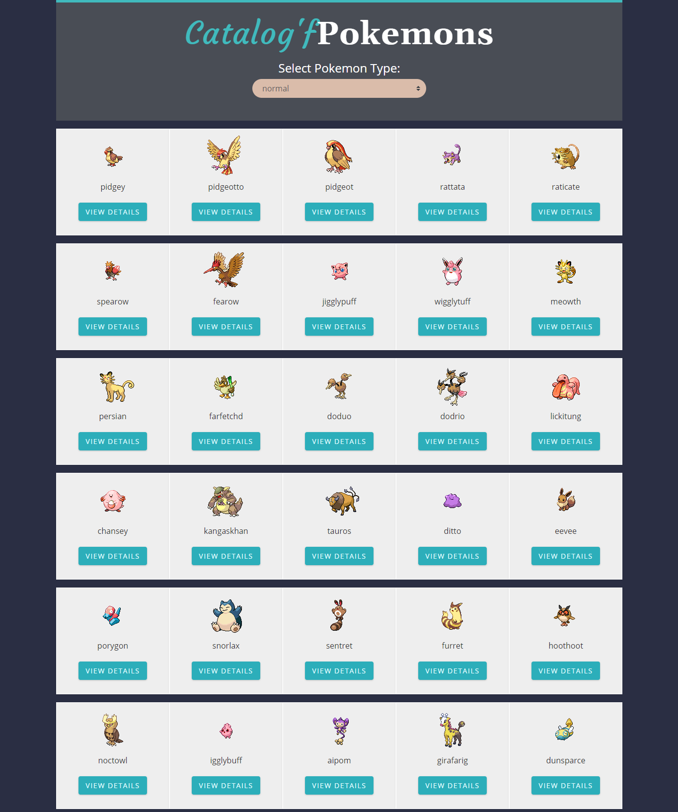

# README

 

# Capstone Project: Catalogue of Statistics

Final React Project of the Microverse Technical Curriculum Program, this project consists in a Single Page Application built with React/Redux, the application uses API calls to display catalogue of pokemons and their statistics by filtering each category of Pokemon through a dropdown list.

> The project, is built following the [Microverse](https://www.notion.so/Catalogue-of-Statistics-72446e7fa33c403a9b6a0bc1de5c6cf5). 

> ​
> 
>

## Video Presentation:

## Link to Live Demo:

[Catalog'fPokemons](https://pokemon-catalogue-stats.herokuapp.com/)

### Project Specification

- Use create-react-app to initialize a new React app
- Add prop-types using npm for typechecking props.
- Add the necessary Redux packages to your project.
- Run the application with npm start and make sure that everything works correctly.
- Use [create-react-app-buildpack](https://github.com/mars/create-react-app-buildpack) to deploy the app to Heroku

### Built With

- Node.js
- React
- React-DOM
- React-Create-App
- Redux
- npm
- CSS
- ES6
- eslint
- stylelint
- Jest
- React Testing library

## Getting Started
To get a local copy up and running follow these steps:

### Prerequisites

npm
Node
create-react-app
### Setup

- Clone the repository by running the code `https://github.com/uimarshall/catalogue-of-statistics-pokemon`
- cd into `catalogue-of-statistics-pokemon` folder
- Run `npm install`.
- Run `npm start` from your command line to open your app in the browser.

Run the app in the development mode.\
Open [http://localhost:3000](http://localhost:3000) to view it in the browser.

The page will reload if you make edits.\
You will also see any lint errors in the console.

### To Fix linting errors

- Run `npm run lintfix`
### Testing

- cd into `catalogue-of-statistics-pokemon` folder

- Run `npm test`
### Deployment

- Sign up on Heroku
- follow instruction to deploy on the Heroku: [Deploy on Heroku](https://github.com/mars/create-react-app-buildpack).
## Authors
#### 👤 **Marshall AKPAN**

- Github: [@uimarshall](https://github.com/uimarshall)
- Twitter: [@uimarshall](https://twitter.com/uimarshall)
- Linkedin: [uimarshall](https://www.linkedin.com/in/marshall-akpan-19745526/)

​
## 🤝 Contributing

Our favourite contributions are those that help us improve the project, whether with a contribution, an issue, or a feature request!

Feel free to check the [issues page](https://github.com/uimarshall/catalogue-of-statistics-pokemon/issues) to either create an issue or help us out by fixing an existing one.
## Show your support

Give a ⭐️ if you like this project!
​
## :clap: Acknowledgements

- Microverse
- creativecommons
- [Nelson Sakwa](https://www.behance.net/gallery/31579789/Ballhead-App-(Free-PSDs)) on [Behance](https://www.behance.net/)
- The Odinproject
- Freecodecamp
- 
Icons made by <a href="https://www.flaticon.com/authors/kiranshastry" title="Kiranshastry">Kiranshastry</a> from <a href="https://www.flaticon.com/" title="Flaticon">www.flaticon.com</a>

  
## �� License

This project is [MIT](lic.url) licensed.

